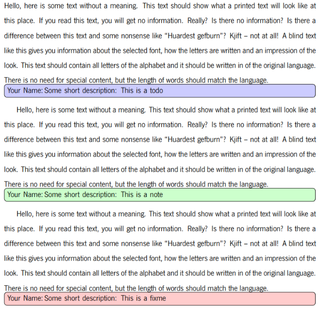
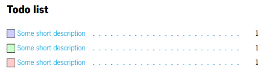

# Dissertation Repository

This repository contains all the files necessary to build my master's thesis dissertation.

## Branches

The repository contains two branches:

- **master** - This branch contains the most up-to-date version of the dissertation. If you are one of my supervisors, 
  then this is the branch you want to look at (unless told otherwise).
- **pre-thesis** - This branch contains the most up-to-date version of the pre-thesis report. If you are one of my 
  supervisors, then this is the branch you want to look at (unless told otherwise).

---
**NOTE TO SUPERVISORS:**
Please read the [Leaving Comments](#leaving-comments) section has
it explains to best way to leave comments on the dissertation.

## Dependencies

To build the dissertation one needs to have the following dependencies installed:

- **xelatex** - Installed with `texlive-xetex`.
- **lang-portuguese** - Installed with `texlive-lang-portuguese`.
- **science** - Installed with `texlive-science`.

The script `install.sh` installs all the dependencies for linux systems.

```console
$ ./install.sh
```

## Building the PDF

Simply run the `build.sh` script.

```console
$ ./build.sh
```
This will generate a bunch of files, including the **dissertation.pdf** file that contains the final dissertation.

To clean the working directory run the `clean.sh` script.

```console
$ ./clean.sh
```


## Leaving Comments

There are a 3 ways that you may leave comments on the dissertation

### Using the `todonotes` latex package

The `todonotes` latex package offers some nice features for leaving comments in a latex document. For simplicity I defined some
macros in top of [this](msc_latex_template/dissertation.tex) file that simplify 99% of all the comments that you may want to leave.

To add a note simply use the `\note` macro like so:

```latex
\note{This is a note}
```

I recommend that you use the `\note` macro with at least the following options:

```latex
\note[author=Your Name, caption=Some short description]{This is a note}
```

I also defined `todo` and `fixme` macros that change only the color of the note sticker. The following example

```latex
\blindtext\todo[author=Your Name, caption=Some short description]{This is a todo}
\blindtext\note[author=Your Name, caption=Some short description]{This is a note}
\blindtext\fixme[author=Your Name, caption=Some short description]{This is a fixme}
```

will be rendered as follows

<p align="center">
  
</p>

and with the following todo list:

<p align="center">
  
</p>

### Using a comment

Since I am developing my dissertation using vscode, I have access to an extension that searches my current directory for anything that matches the follwing regex:

```regex
\s*(TODO|FIXME|BUG|HACK|IDEA|NOTE).*$
```

Basically, start a line with any of the above keywords and the extension will highlight it.

### Use whatever you want

If you don't like any of the above options, then feel free to use whatever you want. Just make sure to tell me where to find your comments.